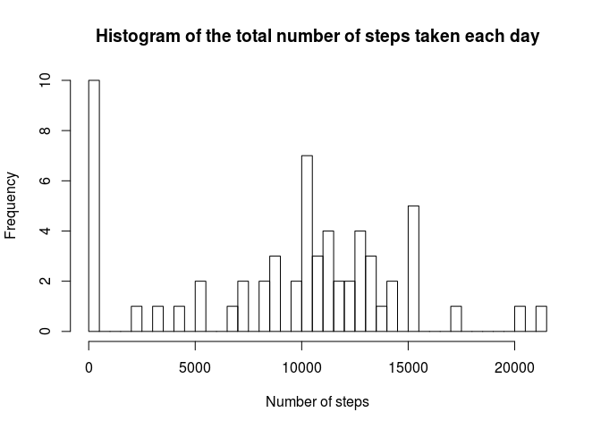
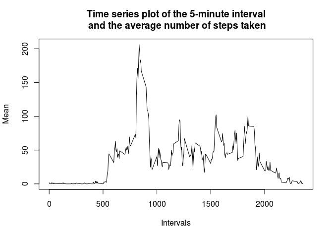
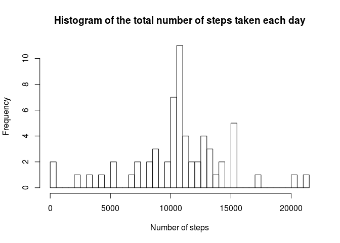
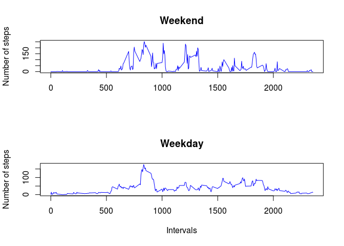

# Reproducible Research: Peer Assessment 1


## Loading and preprocessing the data
For the code to work it is necessary to set your working directory
to the folder with data.

```r
# 1. Loading data
data <- read.csv("activity.csv",
                 colClasses = c("numeric", "factor", "factor"))
```
Any further processing for now is not needed

## What is mean total number of steps taken per day?
In this part of the assignment I have ignored the missing values in
the dataset.


```r
# 1. Plotting histogram
sum.date <- numeric(length = length(levels(data$date)))
names(sum.date) <- levels(data$date)
for(i in seq_along(sum.date)){
    sum.date[i] = sum(data[data$date == names(sum.date)[i], "steps"],
                       na.rm = TRUE)
    # In this case either if sum is equal to 0 or all of the values in that
    # particular day are missing the sum will be equal to 0.
}
hist(sum.date, breaks = 60,
     main = "Histogram of the total number of steps taken each day",
     xlab = "Number of steps")
```

 

```r
# 2A. Mean
Mean <- mean(sum.date)
Mean
```

```
## [1] 9354.23
```

```r
Median <- median(sum.date, na.rm = TRUE)
Median
```

```
## [1] 10395
```

## What is the average daily activity pattern?

```r
# 1A. Preapering data for plotting
intervals <- sort(as.numeric(levels(data$interval)))
names(intervals) <- as.character(intervals)
for(i in seq_along(intervals)){
    intervals[i] = mean(data[data$interval == intervals[i], "steps"],
                        na.rm = TRUE)
}
# 1B. Plotting
plot(names(intervals), intervals,
     type = "l", xlab = "Intervals", ylab = "Mean",
     main = "Time series plot of the 5-minute interval\n and the average number of steps taken")
```

 

```r
# 2. Which interval contains the maximum number of steps ?
Max <- max(data$steps, na.rm = TRUE)
as.numeric(data[data[!is.na(data$steps), "steps"] == max(data$steps, na.rm = TRUE),
                "interval"])
```

```
## [1] 244
```

## Imputing missing values

```r
# 1. Number of missing values
sum(is.na(data$steps))
```

```
## [1] 2304
```
2. As for my strategy:
    I will replace all NA's values with median for that interval

```r
# 3. Creating new dataset
steps <- data$steps
for(i in seq_along(steps)){
    if(is.na(steps[i])){
        steps[i] = intervals[[ data[i, "interval"] ]]
    }
}
new.data <- data.frame(steps, data$date, data$interval)
names(new.data) <- names(data)
```

```r
# 4. Plotting histogram
for(i in seq_along(sum.date)){
    sum.date[i] = sum(new.data[new.data$date == names(sum.date)[i], "steps"])
}
hist(sum.date, breaks = 60,
     main = "Histogram of the total number of steps taken each day",
     xlab = "Number of steps")
```

 
New mean...

```r
new.mean <- mean(sum.date)
new.mean
```

```
## [1] 10766.19
```
...and new median

```r
new.median <- median(sum.date)
new.median
```

```
## [1] 10766.19
```
Do they differ ?

```r
differences <- data.frame(c(Mean, new.mean), c(Median, new.median),
                         row.names = c("means", "medians"))
names(differences) <- c("NA excluded", "NA replaced")
differences
```

```
##         NA excluded NA replaced
## means       9354.23    10395.00
## medians    10766.19    10766.19
```
Median are exacly the same, but we can observe that the replacing of missing values have a huge impact on the differences in the mean values.

## Are there differences in activity patterns between weekdays and weekends?

```r
# 1. Processing data
new.data$date <- as.POSIXct(new.data$date, tz = "GTM") +
    (60 * as.numeric(as.character(new.data$interval)))
new.data$date <- as.POSIXlt(new.data$date)
isWeekend <- character(dim(new.data)[1])
for(i in seq_along(isWeekend)){
    if(new.data[i, "date"]$mday == 6 || new.data[i, "date"]$mday == 7){
        isWeekend[i] <- "weekend"
    } else{
        isWeekend[i] <- "weekday"
    }
}
new.data$isWeekend <- as.factor(isWeekend)
head(new.data)
```

```
##        steps                date interval isWeekend
## 1  1.7169811 2012-10-01 00:00:00        0   weekday
## 2 99.4528302 2012-10-01 00:05:00        5   weekday
## 3  0.3396226 2012-10-01 00:10:00       10   weekday
## 4 31.4905660 2012-10-01 00:15:00       15   weekday
## 5 25.5471698 2012-10-01 00:20:00       20   weekday
## 6 74.5471698 2012-10-01 00:25:00       25   weekday
```

```r
# 2A. Preapering subdata
sub.weekend <- new.data[new.data$isWeekend == "weekend",]
iWeekend <- sort(as.numeric(levels(sub.weekend$interval)))
names(iWeekend) <- as.character(iWeekend)
for(i in seq_along(intervals)){
    iWeekend[i] = mean(sub.weekend[sub.weekend$interval == iWeekend[i], "steps"])
}

sub.weekday <- new.data[new.data$isWeekend == "weekday",]
iWeekday <- sort(as.numeric(levels(sub.weekday$interval)))
names(iWeekday) <- as.character(iWeekday)
for(i in seq_along(intervals)){
    iWeekday[i] = mean(sub.weekday[sub.weekday$interval == iWeekday[i], "steps"])
}

# 2B. Creating the plot
par(mfcol = c(2, 1))
plot(names(iWeekend), iWeekend, type = "l",
     xlab = NA, ylab = "Number of steps",
     main = "Weekend", col = "blue")

plot(names(iWeekday), iWeekday, type = "l",
     xlab = "Intervals", ylab = "Number of steps",
     main = "Weekday", col = "blue")
```

 
